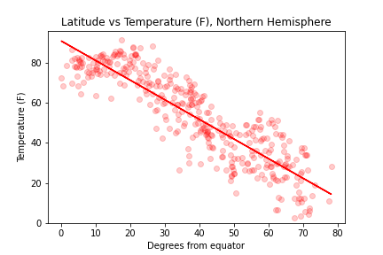
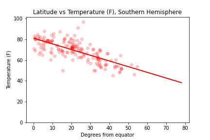

# WeatherPy and VacationPy

## Overview

The goal of this assignment is to query APIs to find hotels in a random sampling of cities. It goes:

### WeatherPy:

- Get a random sampling of cities by name using a simple dataset called CitiPy
- Query the OpenWeather API for each city, using try/except to ignore ones that don't return a result
- Put all that data into a Pandas DataFrame
- Create scatter plots to explore how latitude correlates to temp, humidity, cloudiness, and wind speed

    

    *(Looks pretty windy up by the poles)*

- Do the same thing, but this time split data by hemisphere and make 1 for each hemisphere

    
    

    *(Guess it's colder up north in mid-autumn)*

- Save all figures to PNG files, and write the DataFrame to a CSV file

### VacationPy:

- Read the CSV file from the WeatherPy part into a DataFrame and filter by various weather criteria
- Get the closest hotels to each city from Google Places
- Create a Google Maps figure
- Add markers for all the hotels returned
- Make it so little info boxes pop up when you click on the markers
- Add a heatmap using the humidity values from the original unfiltered DataFrame

At the end of all that, you get something like this:

*(Maybe I should take a trip to Arabia?)*